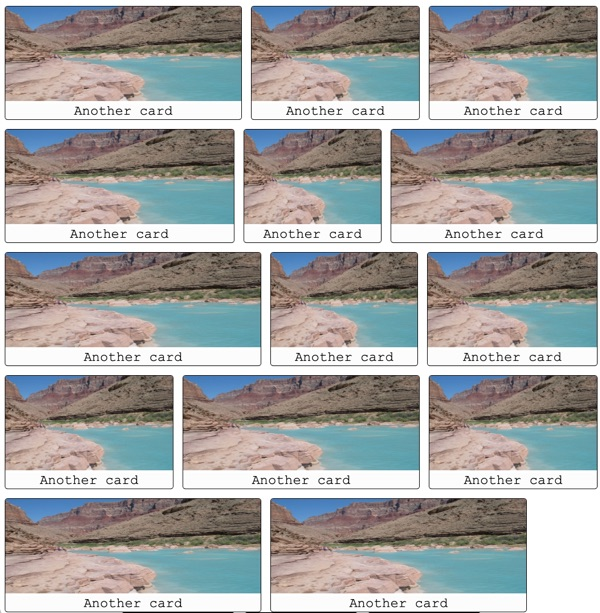
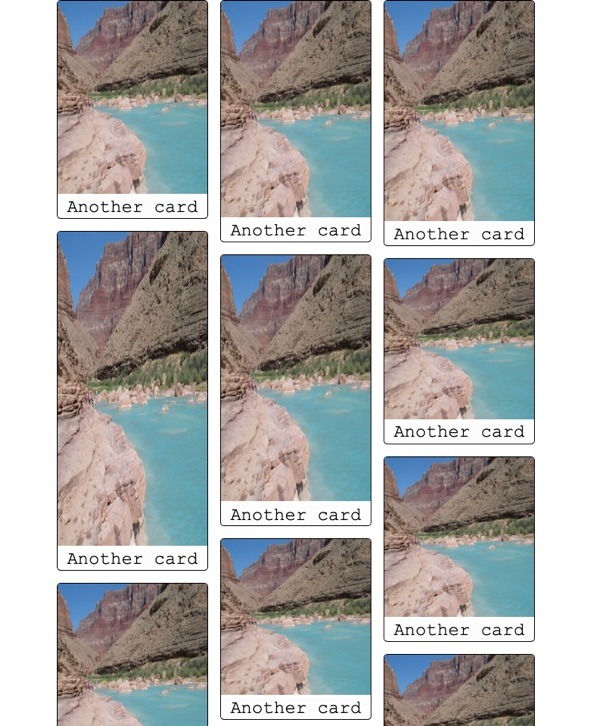

# Week 05: Flexbox Layout

## Step 01: Grab the starter code

Download this starter code and open it in your editor. It contains a bit of Javascript to randomly generate a bunch of different sized media elements. Note that there are two sets...the first class="row-grid" will all have the same height. The second class="col-grid" should all have the same width.

Everytime you refresh the page you will get a different set of cards.

## Step 02: Style the row grid

Use flexbox to style the row-grid to match the example below.

## Step 03: Style the col grid

Use flexbox to style the col-grid to match the example below.

## Grading

- Row and column layouts are styled similar to the screenshots.
- Layouts are done with Flexbox.